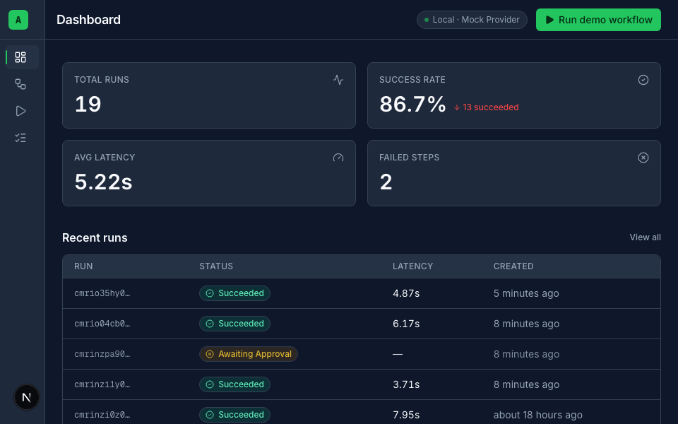
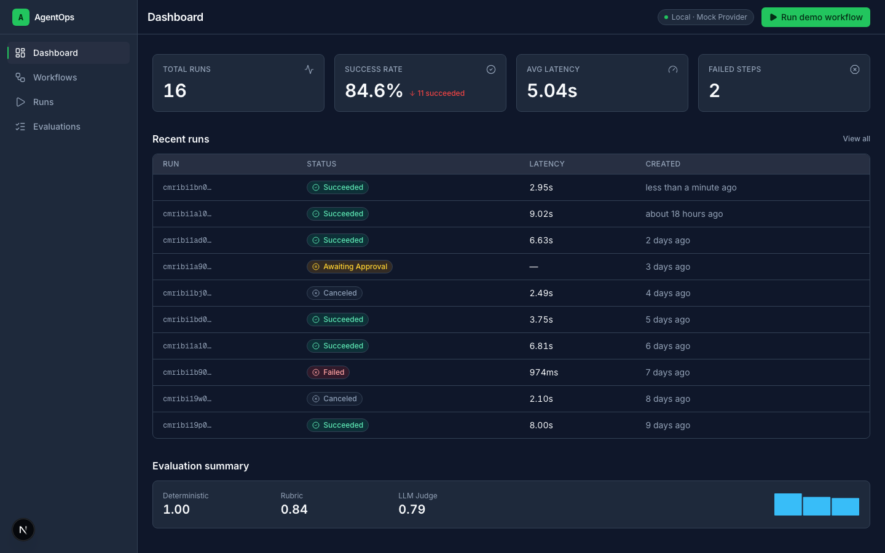
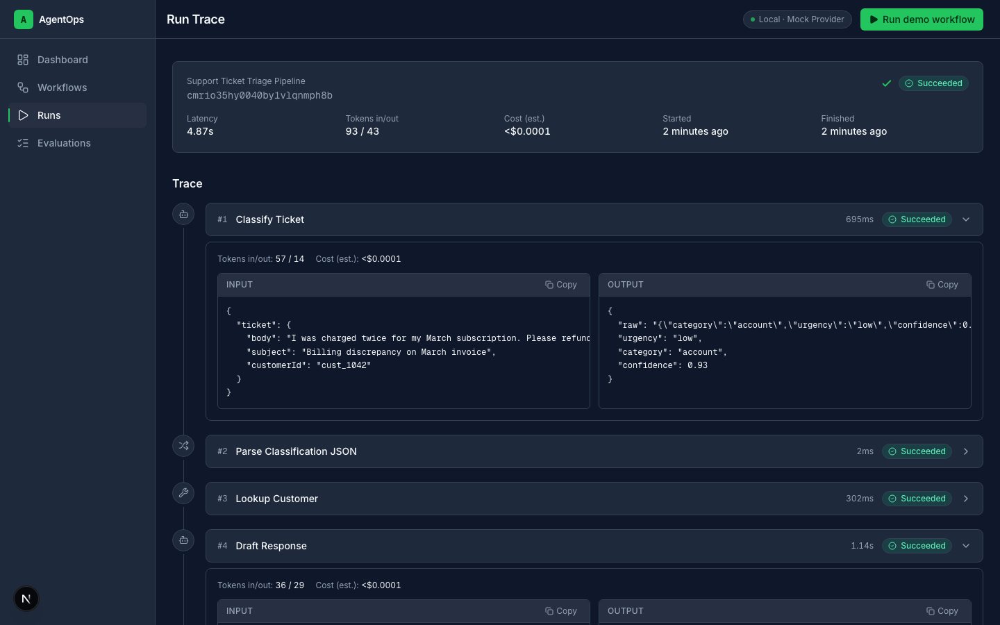
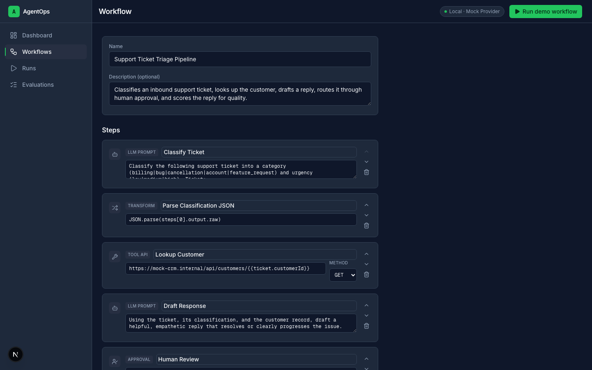
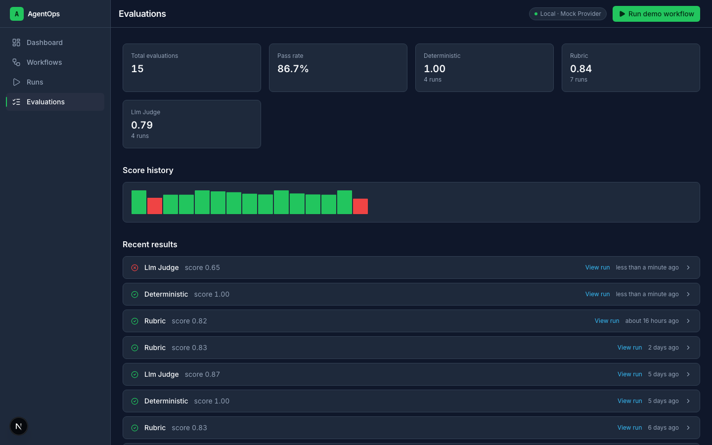
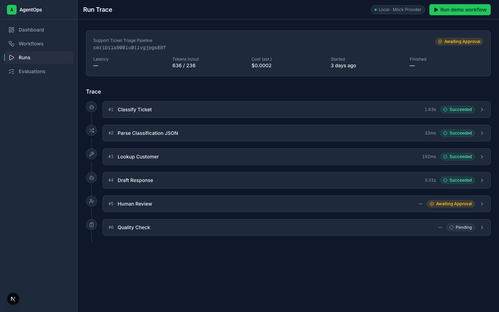

# AgentOps Command Center

A full-stack AI workflow observability & evaluation platform — a lightweight LangSmith × Zapier, built to run locally with zero API keys.

Design a multi-step agent workflow, run it against a mock LLM/tool provider, watch it execute in a background worker, pause it at a human-approval checkpoint, and inspect a developer-grade trace with per-step latency, retries, and evaluation scores — all backed by Postgres and BullMQ.

## Demo



*The 30-second story: run the seeded triage pipeline → it pauses at the human-approval checkpoint → approve → it resumes and succeeds with evaluation scores. Re-record anytime with `node scripts/record-demo-gif.mjs`.*

## Screenshots

> Captured live from the seeded local app (1440×900, dark). Re-capture anytime with `node scripts/capture-screenshots.mjs` (dev server + worker running).

| Dashboard | Trace viewer |
|---|---|
|  |  |

| Workflow builder | Evaluations |
|---|---|
|  |  |

| Approval checkpoint | |
|---|---|
|  | |

## Features

- **Workflow builder** — ordered-list editor for 5 step types: `LLM_PROMPT`, `TOOL_API`, `TRANSFORM`, `HUMAN_APPROVAL`, `EVALUATION`. Add, reorder, edit, and delete steps; each has type-specific config.
- **Queue-backed async execution** — `POST /api/runs` enqueues a BullMQ job and returns immediately; a separate worker process executes the workflow step by step against Postgres, so the UI never blocks on a run.
- **Step-level tracing** — every step execution records status, latency, retry count, and a token/cost estimate (mock-provider placeholder), plus full input/output JSON, viewable in an expandable trace timeline.
- **Human-in-the-loop approvals** — a run pauses at a `HUMAN_APPROVAL` step (`awaiting_approval`), surfaces the pending decision in the UI, and resumes (approve) or terminates (reject) on your call. Decision + timestamp persist.
- **3-evaluator framework** — deterministic checks (contains/regex/JSON-valid/length), weighted rubric scoring, and an LLM-as-judge interface that returns a clearly-labeled mock score in mock mode. Every result persists and rolls up into an evaluation history and dashboard summary.
- **Mock provider = zero API keys** — `PROVIDER_MODE=mock` (the default) drives all LLM/tool calls with realistic simulated latency (150–1200ms) and an ~8% transient-failure rate so traces show real retries, no external API or key required.

## Architecture

```
                          ┌───────────────────────────────────────────┐
                          │   Next.js app (app/)  — ONE deployable     │
                          │                                             │
   [Browser UI] ──HTTP──► │   Route Handlers (src/app/api/**)          │
    SWR polling ◄─────────│         │   Zod validation                 │
    (2s interval)         │         │ Prisma                           │
                          │         ▼                                   │
                          │   [PostgreSQL] ◄───────────────┐            │
                          │         ▲                       │ Prisma    │
                          │         │ enqueue { runId }      │          │
                          │         ▼ (BullMQ)               │          │
                          │   [Redis queue]                  │          │
                          └─────────┼──────────────────────────┼───────┘
                                    │ same package, npm run worker       │
                          ┌─────────▼──────────────────────────┴───────┐
                          │  Worker process (src/worker/index.ts)       │
                          │   runner.ts → src/lib/executors/            │
                          │   (llm_prompt | tool_api | transform |      │
                          │    approval | eval)                         │
                          │   → src/lib/providers (MockLlmProvider)     │
                          │   → writes StepExecution + EvaluationResult │
                          └───────────────────────────────────────────┘
```

One Next.js package (`app/`) is the single deployable unit. `npm run dev` and `npm run worker` are two entrypoints into the same codebase, sharing one Prisma client and one `.env`. Docker Compose runs only the stateful services (Postgres, Redis) — the app and worker run on the host.

## Tech stack

| Layer | Choice |
|---|---|
| Frontend | Next.js (App Router) + TypeScript + Tailwind CSS + Framer Motion |
| Backend | Next.js Route Handlers, Zod validation at every request boundary |
| Data | PostgreSQL 16 + Prisma (typed client, migrations) |
| Queue | Redis 7 + BullMQ |
| Worker | `tsx src/worker/index.ts` — second entrypoint, same package |
| Tests | Vitest (135 unit/integration tests) + Playwright e2e |
| Local infra | Docker Compose (Postgres + Redis only) |

## Quickstart

Requires Docker, Node.js, and npm. No API keys, no signup, no paid services.

```bash
cd app
cp .env.example .env
docker compose up -d              # postgres:16 on host 5433, redis:7 on 6379
npm install
npx prisma migrate dev            # creates the schema
npm run db:seed                   # 2 sample workflows + ~16 historical runs/traces/evals
npm run dev                       # terminal 1 — Next.js on :3000
npm run worker                    # terminal 2 — BullMQ worker
```

Then open **http://localhost:3000**.

> **Note:** Postgres is mapped to host port **5433**, not the default 5432 — many dev machines already run a native Postgres on 5432, and this avoids colliding with it. `.env.example`'s `DATABASE_URL` already points at 5433; you don't need to change anything unless your own Postgres is *also* on 5433.

Run the test suite any time with:

```bash
npm test
```

## 2-minute demo script

1. **Land on the Dashboard** — already populated from the seed: real metric cards (total runs, success rate, avg latency, failed steps), a recent-runs list, and an evaluation summary. Nothing is empty or `NaN` on first load.
2. **Open a completed run's trace** from "recent runs" — expand step cards to see input/output JSON, latency, retry count, and cost-estimate placeholders, including a `FAILED` step's error panel.
3. Click **"Run demo workflow"** — this launches the "Support Ticket Triage Pipeline" (the seeded workflow with an approval step) with a pre-filled sample input. Watch the trace update live as the worker processes each step.
4. **Hit the approval checkpoint** — the run pauses at `awaiting_approval`. Click **Approve** and watch it resume to `succeeded` (or re-run and **Reject** to see the other terminal path). The mock provider intentionally fails ~8% of calls to exercise retries; runs survive this via automatic step retries (residual demo-failure chance ≈0.2% — and a failed run is itself a demo of the error/retry trace).
5. **Open Evaluations** — see deterministic + rubric scores and the labeled LLM-judge placeholder, with history tying back to individual runs.

Total: dashboard → trace → run → approve → evaluations, no API keys, roughly 4.5s of actual step-execution latency per run.

## Testing

135 tests across the runner, all 5 step executors, all 3 evaluators, the mock provider, and the API routes (workflows, runs, approve/reject, dashboard):

```bash
npm test          # vitest run — 135/135 passing
npx tsc --noEmit  # clean
npm run lint      # clean
npm run build     # production build succeeds
npm run test:e2e  # Playwright: the full demo path against the live local stack
```

## Limitations

- **Mock provider by default.** `PROVIDER_MODE=mock` runs the whole demo with zero API keys. A real provider is shipped and live-verified: set `PROVIDER_MODE=live` plus the `LLM_*` vars (see `.env.example` — free-tier presets for Google Gemini, Groq, and OpenRouter; verified end-to-end on Gemini `gemini-flash-lite-latest`, including real classification JSON, context-aware drafts, and real rubric judge scores). Your key lives in `.env` and is never committed.
- **No authentication.** Single local user, no accounts, no multi-tenancy — by design, not an oversight. Not intended for public/internet deployment as-is.
- **Polling, not WebSockets.** The trace viewer polls `GET /api/runs/{id}` every 2 seconds until the run reaches a terminal status. Fine for one local viewer; would need a realtime transport for many concurrent viewers.
- **Dark mode only.** Light mode was deferred to keep the design system scope small for the MVP.
- **Token/cost figures are placeholders.** They're computed estimates from the mock provider, not billed values.

## License / Author

Built by **Jason Lukose** as a portfolio/resume project. License: MIT (or update as you see fit).
